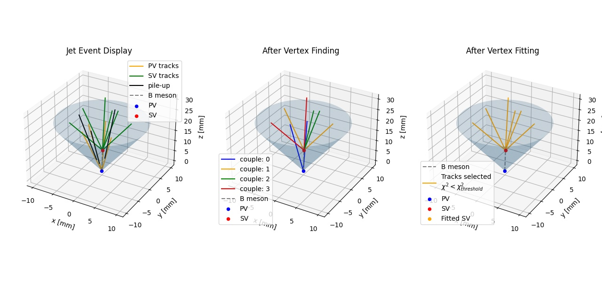
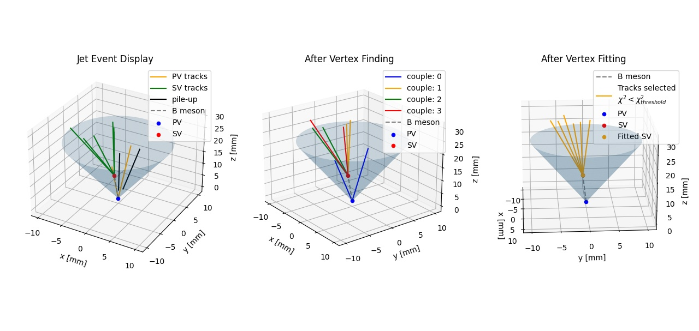
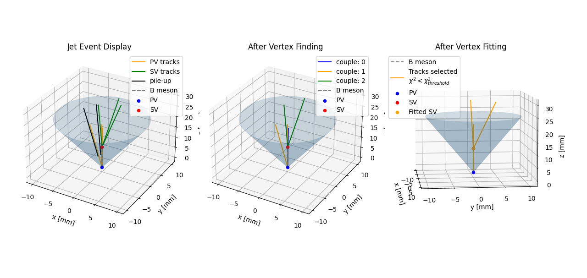

### Toy reproduction of SSVF algorithm

Repository content:
- `.modules/Track`: Class to represent a track in the jet;
- `.modules/Jet`: Class to represent a jet;
- `.modules/JetGenerator`: Class that implements a simple jets Montecarlo generator;
- `.modules/ssvf`: Class that implements the SSVF algorithm;
- `./test.py`: test of the modules;
- `./errorsHist.py`: test of SSVF on 100 jets and plot of the errors' histogram;
- `./clustering.py`: KMeans clustering applied to a jet;
- `./clusteringSSVFtest.py`: test of clustering based SSVF;
- `./ssvfVSclustering.py`: SSVF vs C-SSVF errors and execution times comparison;
- `./notes/notes.md`: notes on the implementation of SSVF and of the tracks linear algebra;
- `./slides`: slides for this project;

#### Result of the SSVF algorithm

Interesting event, with a track from the PV that passes near the SV and is consequently  misclassified as a SV track:

